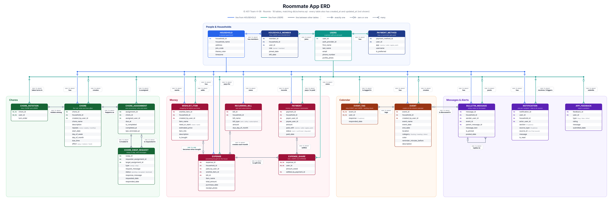

# Roomie

IS 401 Team 4-06. 
Heidi Barlow
Michael Bertoldo
Frankie Capello
Ashlynne Hawkins
A shared-house app for roommates: chores, costs, calendar and a message board in one place.

## App Summary

College students who move in with new or unrelated roommates rarely sit down and agree on how the house will run. Expectations go unspoken, so everyone assumes someone else will take out the trash, buy the paper towels, or ask before hosting friends. The group text where these things get sorted out is quickly buried under memes and plans, so a request from Tuesday is lost by Thursday. Chores and money then turn into tension, because nobody can see who did what or who owes whom. Roomie gives each household one shared place to fix this: a chore chart with one-time or repeating chores that are assigned or rotated, with swap and skip requests when life gets in the way. It splits shared purchases to the exact cent, shows who owes whom, and lets the person who gets paid confirm repayment through Venmo, Zelle or Apple Cash. A shared calendar, a sticky-note board for checking in before hosting, a wish list and a notification dashboard keep everyone on the same page, and the features come from [docs/requirements.csv](docs/requirements.csv).

## ERD



Every table also has `created_at` and `updated_at` columns (not shown in the diagram). The schema is in [db/schema.sql](db/schema.sql).

## Tech Stack

| Layer | What we use | Why it fits our team |
|---|---|---|
| Frontend | Vite, plain JavaScript and CSS | Fast to start, no framework to learn mid-semester, and it builds to static files Vercel serves for free. |
| Backend | Vercel serverless functions in `api/` (TypeScript) | Free on the Hobby plan, deploys with the frontend, and every route passes through one shared security check (`withUser` / `withHousehold`) so no one has to remember to protect a new endpoint. |
| Database | Neon Postgres | Free tier, and real SQL tables we can open and inspect in Neon's table editor. This is what the ERD describes. It has separate `dev` and `main` branches, so testing never touches the demo data. |
| Sign-in | Neon Auth | Handles accounts and sessions so we do not store passwords ourselves. It lives next to the database, on the same free plan. |
| Data access | Drizzle ORM | Typed queries generated from the live tables (`npm run db:pull`), so a schema change shows up as a compile error rather than a runtime bug. We keep the SQL close to the surface instead of hiding it. |

## How to Get It Running

### Use the live app

Open **https://roomie-mockup.vercel.app**, choose **Create an account**, sign up, then join the demo household with code **`MAPLE412`**.

### Run it from a fresh clone

You need Node 22 or newer, git, and a free [Neon](https://neon.tech) account.

1. Clone and install:
   ```
   git clone https://github.com/michaelbertoldo/roomie.git
   cd roomie
   npm install
   ```
2. Create a Neon project (any name, Postgres 17). On the project dashboard, copy the **pooled** connection string and the **direct** (non-pooled) one (the "Connection pooling" toggle switches between them).
3. In the Neon console open **Auth** and enable Neon Auth for the project. Copy its **Auth URL**. Under trusted origins make sure `http://localhost:5173` is allowed (localhost is trusted by default).
4. Create your env file and fill it in:
   ```
   cp .env.example .env.local
   ```
   - `DATABASE_URL`: the pooled connection string
   - `DATABASE_URL_UNPOOLED`: the direct connection string
   - `NEON_AUTH_URL`: the Auth URL from step 3
   - `ROOMIE_DB_BRANCH`: leave as `dev`
   - `CRON_SECRET`: any random string of 32+ characters (only needed for the scheduled chore job; leave empty to disable it)

   `.env.local` is git-ignored. Never commit it.
5. Create the tables. Paste the contents of `db/schema.sql` into the Neon **SQL Editor** and run it, or from a terminal with `psql`:
   ```
   psql "$DATABASE_URL_UNPOOLED" -f db/schema.sql
   ```
   Then run `db/migrations/0002_lock_set_updated_at.sql` the same way. (`0001` only removes an old prototype from our own database, so a fresh project does not need it.)
6. Load the sample data (every table gets at least 3 rows):
   ```
   npm run db:seed
   npm run db:counts      # optional: rows per table
   ```
7. Start the app, in two terminals:
   ```
   npm run dev:api        # API on http://localhost:3001
   npm run dev            # app on http://localhost:5173
   ```
8. Open http://localhost:5173, create an account, and join with code `MAPLE412`.

Other useful commands: `npm test` (unit tests), `npm run test:security` (live API and access-rule checks against your database), `npm run typecheck`.

## Verifying the Vertical Slice

The slice is **marking a chore done**: the button sends a request to the backend, the backend updates the database, returns the updated chore, and the page shows it as done. It still shows as done after a refresh because it is read back from the database.

A brand-new account has no chores assigned to it yet (only the person a chore is assigned to can mark it done), so first give yourself one:

1. Sign in and join with code `MAPLE412` if you have not already.
2. Click **Chores** in the navigation.
3. Click **Add chore**. Type a name such as `Test chore`, choose **One time**, leave the date as today, leave **Who does it?** on **One person** with **(you)** selected, and click **Add chore**.
4. Your chore appears on the schedule with a round check button on its left. Click it. A toast says "Nice. Marked done." and the chore now shows a green **Done** chip with today's date.
5. Refresh the browser (or sign out and back in). The chore still shows **Done** with the same date.

To see the row in the database: in the Neon console open **Tables**, pick the `chore_assignment` table, and find the row for your chore. `is_completed` is `true` and `completed_at` holds the time you clicked. The `updated_at` column also changed, set by a database trigger.

To undo it, click the same button again (it marks the chore not done).
